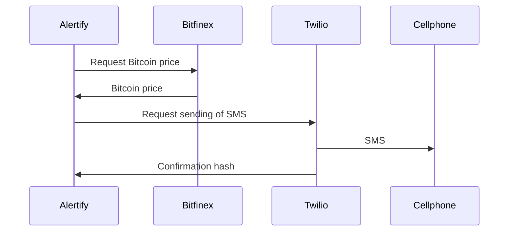
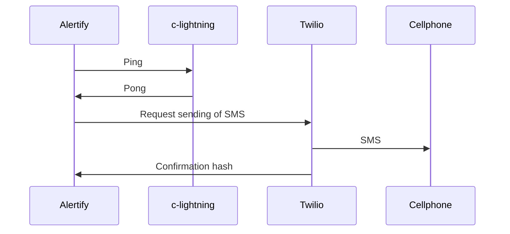

Checks site for Bitcoin price data

Clone the repo and cd into it:

`git clone git@github.com:michaelfolkson/alertify.git`

`cd alertify`

Install virtualenv (you'll be able to use pip3 if you have installed Python3):

`pip3 install virtualenv`

In your project directory make a virtual environment:

`python3 -m venv alertify_venv`

Activate the virtual environment:

`source alertify_venv/bin/activate`

Install the requirements:

`pip3 install -r requirements.txt`

Deactivate the virtual environment:

`deactivate`


Process diagram: https://v.gd/0cBnHM



Pinging c-lightning node

Process diagram: https://v.gd/ouBvmq



Receive SMS alert when there is Lightning channel cheat attempt

Process diagram: https://v.gd/3uyJKP

```mermaid
sequenceDiagram
    participant Alertify
    Alertify ->> lightningd: Request check on channel cheat attempt
    lightningd ->> bitcoind: Request transaction data of revoked states
    bitcoind ->> lightningd: Return transaction data
    lightningd ->> Alertify: Cheat attempt detected
    Alertify ->> Twilio: Request sending of SMS
    Twilio ->> Cellphone: SMS warning
    Twilio ->> Alertify: Confirmation hash
 ```
